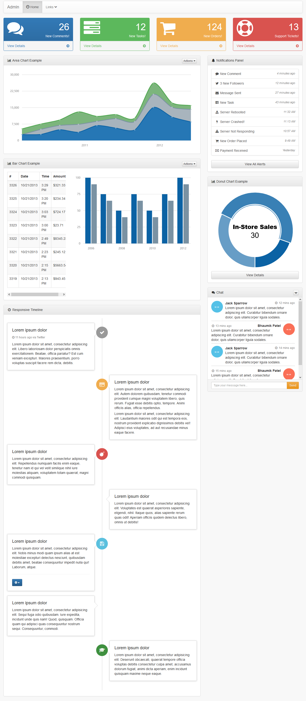

使用 sb-admin-2 前端模板给 flask-admin 添加 Dashboard
######################################################

准备工作
*********

首先要编译前端页面，安装 npm 和 bower ::

    $ npm install -g bower

编译::

    $ cd app/static/sb-admin-2
    $ bower install

快速开始
*********

::

    pipenv install
    pipenv run flask run

访问： http://127.0.0.1/admin

示例图
*******

相关资料
*********

- flot api: https://github.com/flot/flot/blob/master/API.md
