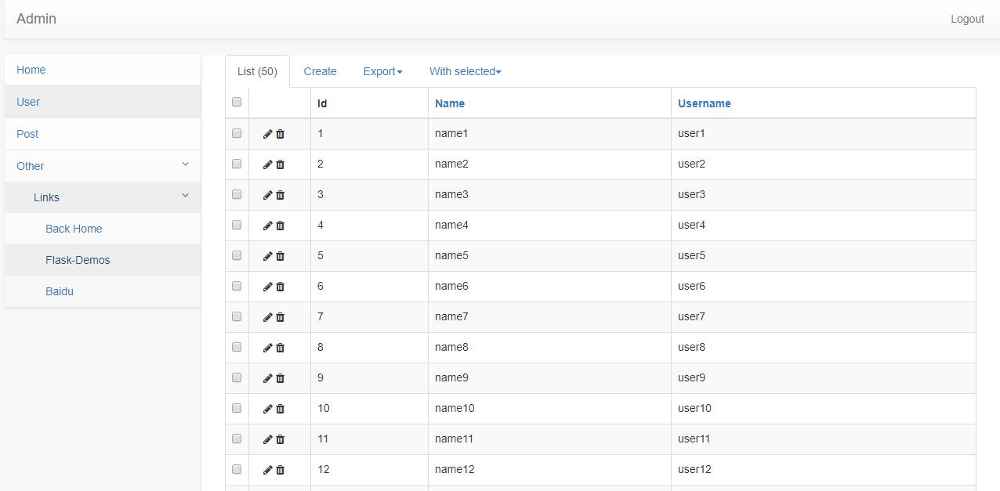

使用 sb-admin-2 样式客制化 flask-admin navbar
#################################

编译前端页面
***********************

首先需要安装npm和bower::

    $ npm install -g bower

编译::

    $ cd app/static/sb-admin-2
    $ bower install

快速开始
*********

::

    pipenv install
    pipenv run flask run

效果图
*******

