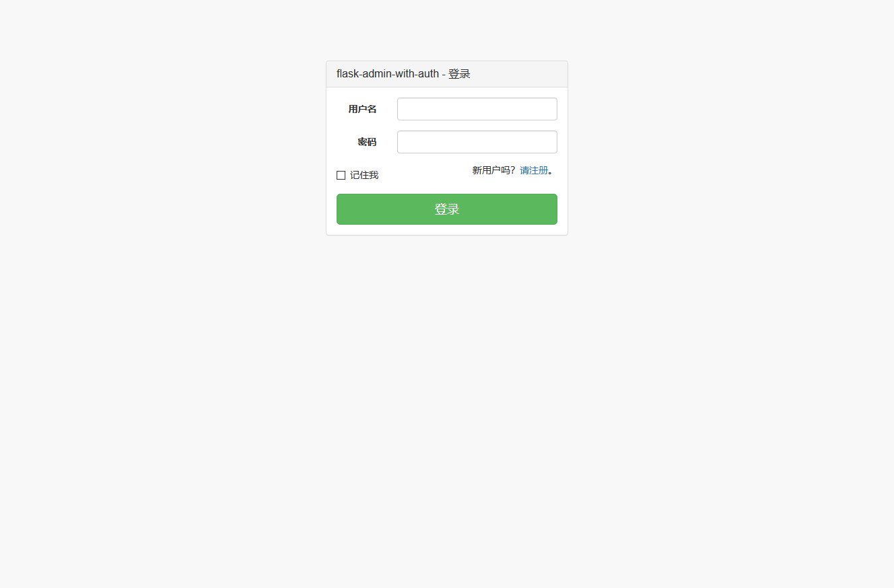
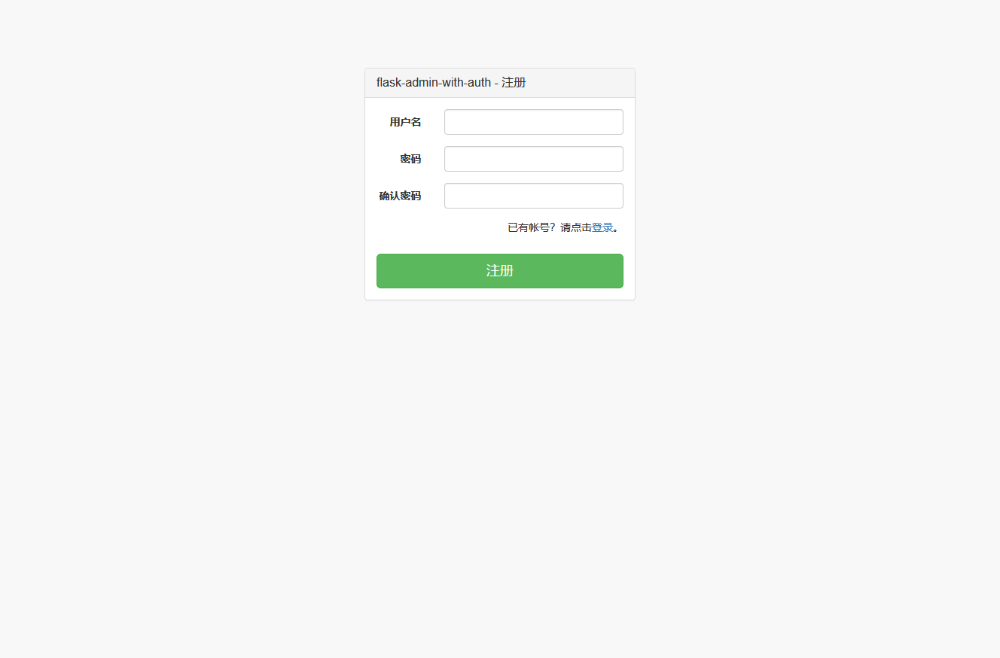

给 flask-admin 添加登录注册功能
################################

准备工作
***********

首先需要安装npm和bower::

    $ npm install -g bower

编译::

    $ cd app/static/sb-admin-2
    $ bower install

快速开始
*********

::

    pipenv install
    pipenv run flask run

访问： http://127.0.0.1:5000/admin/login 登录

效果图
*******

登录页面

注册页面

