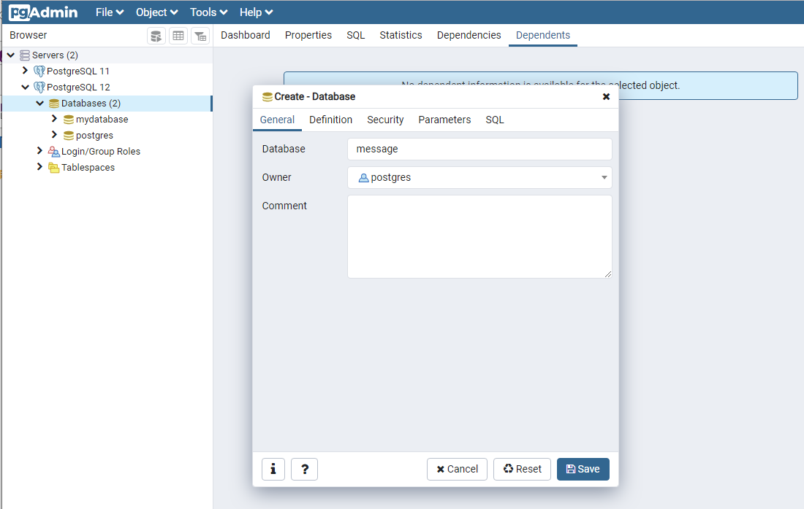
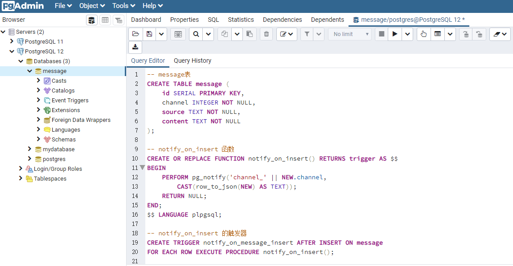
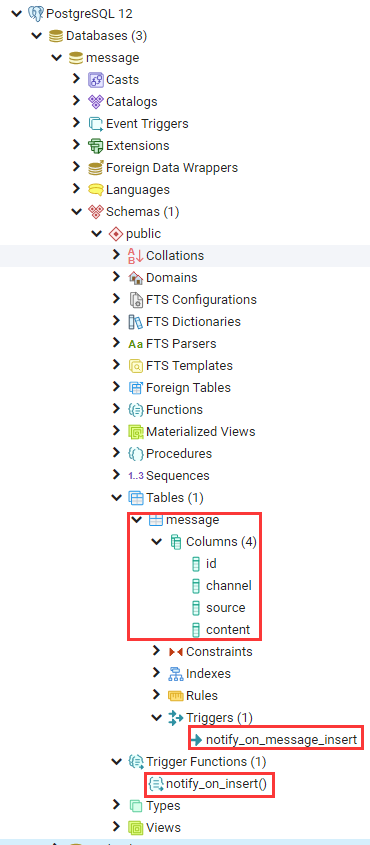
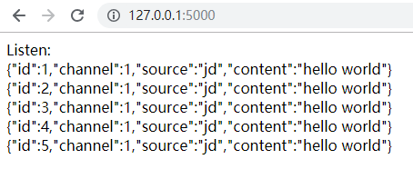

# 用 Flask 和 PostgreSQL 流化数据

Fork form 《Python高手之路（第三版）》 14.1 章节

## 准备工作

首先需要准备 PostgreSQL 数据库，新建一个 message 数据库



然后拷贝创建脚本初始化数据库

```sql
-- message表
CREATE TABLE message (
    id SERIAL PRIMARY KEY,
    channel INTEGER NOT NULL,
    source TEXT NOT NULL,
    content TEXT NOT NULL
);

-- notify_on_insert 函数
CREATE OR REPLACE FUNCTION notify_on_insert() RETURNS trigger AS $$
BEGIN
    PERFORM pg_notify('channel_' || NEW.channel,
        CAST(row_to_json(NEW) AS TEXT));
    RETURN NULL;
END;
$$ LANGUAGE plpgsql;

-- notify_on_insert 的触发器
CREATE TRIGGER notify_on_message_insert AFTER INSERT ON message
FOR EACH ROW EXECUTE PROCEDURE notify_on_insert();
```



最后可以看到数据库的 Schemas 结构如下




### nofify_on_insert 的触发函数

下面先通过 psql 中的 LISTEN 操作来检查是否工作正常：

```shell
Server [localhost]:
Database [postgres]: mydatabase
Port [5432]:
Username [postgres]:
用户 postgres 的口令：
psql (12.1)
输入 "help" 来获取帮助信息.

mydatabase=# LISTEN channel_1;
LISTEN
mydatabase=# INSERT INTO message(channel, source, content) VALUES(1, 'jd', 'hello world');
INSERT 0 1
从PID为5656的服务器进程接收到带有字节流量"{"id":1,"channel":1,"source":"jd","content":"hello world"}"的异步通知消息"channel_1".
mydatabase=#
```

### 启动Flask

打开 PowerShell：

```python
pipenv install
pipenv run flask run
```

访问：http://127.0.0.1:5000/

每当在 psql 中输入 `INSERT INTO message(channel, source, content) VALUES(1, 'jd', 'hello world');` 时，可以看到浏览器也接收到了消息



