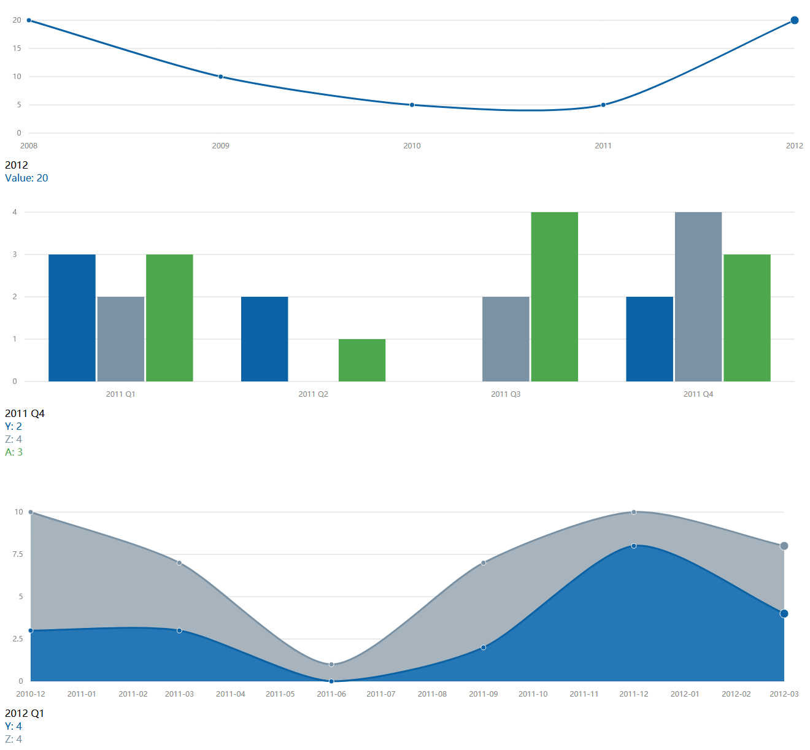

flask 中使用 morrisjs 显示统计图表
##################################

快速开始
*********

::

    pipenv install
    pipenv run flask run

访问： http://127.0.0.1:5000/

相关资料
********

- morris.js 官网： https://morrisjs.github.io/morris.js/

示例图
*******

